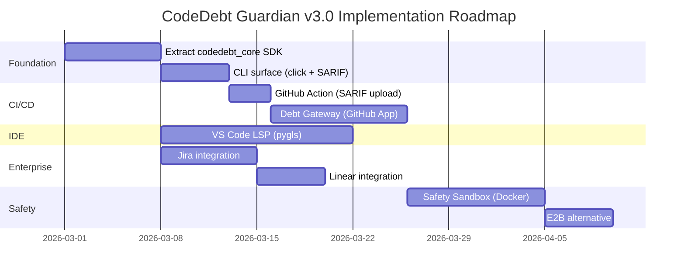

# 🏗️ ARCHITECTURE_ROADMAP.md — Enterprise Omnipresent Platform

> **CodeDebt Guardian v3.0 — From Backend Script to Enterprise Platform**
>
> This document is the technical blueprint for expanding CodeDebt Guardian into a
> multi-surface, enterprise-grade platform. Every section contains specific library
> names, API endpoints, and architectural patterns ready for implementation.

---

## Table of Contents

1. [Pillar 1: Multi-Platform Architecture](#pillar-1-multi-platform-architecture)
2. [Pillar 2: The Safety Sandbox](#pillar-2-the-safety-sandbox-test-before-pr)
3. [Pillar 3: Enterprise Workflow Ticketing](#pillar-3-enterprise-workflow-ticketing-jiralinear)
4. [Pillar 4: The Debt Gateway CI/CD Blocker](#pillar-4-the-debt-gateway-cicd-blocker)
5. [Dependency Map & Phasing](#dependency-map--phasing)

---

## Pillar 1: Multi-Platform Architecture

### Problem

Our analysis engine currently lives inside a monolithic call chain:
`api/main.py → agents/orchestrator.py → agents/debt_detection_agent.py → tools/*`.
Every new surface (CLI, GitHub Action, VS Code) that wants to scan code would need
to duplicate this wiring. We need **one engine, many frontends**.

### Solution: Extract a `codedebt-core` SDK Package

```
codedebt-guardian/
├── codedebt_core/                    # ← NEW: pip-installable SDK
│   ├── __init__.py                   # Public API: scan(), scan_stream(), ScanResult
│   ├── engine.py                     # Wraps orchestrator (sync + async)
│   ├── models.py                     # Pydantic models (ScanConfig, ScanResult, Issue)
│   └── py.typed                      # PEP 561 marker
├── surfaces/
│   ├── cli/                          # Click-based CLI
│   │   └── __main__.py
│   ├── github_action/                # action.yml + entrypoint
│   │   ├── action.yml
│   │   └── entrypoint.py
│   └── vscode_lsp/                   # pygls Language Server
│       ├── server.py
│       └── package.json              # VS Code extension manifest
├── agents/                           # Existing — unchanged
├── tools/                            # Existing — unchanged
├── api/                              # Existing FastAPI surface — unchanged
└── pyproject.toml                    # Replaces setup.py
```

### 1A. The Core SDK (`codedebt_core`)

**Key Design:** A thin, stable public API that hides all internal complexity.

```python
# codedebt_core/engine.py
from dataclasses import dataclass
from typing import Iterator
from agents.orchestrator import CodeDebtOrchestrator

@dataclass
class ScanConfig:
    repo_url: str
    branch: str = "main"
    max_files: int = 500
    enable_satd: bool = True
    enable_hotspots: bool = True

@dataclass
class ScanResult:
    issues: list
    tdr: dict
    hotspots: list
    fix_proposals: list
    summary: dict
    scan_id: str

def scan(config: ScanConfig) -> ScanResult:
    """Synchronous, blocking scan. Returns complete results."""
    orch = CodeDebtOrchestrator(use_persistent_memory=False)
    raw = orch.run_full_analysis(config.repo_url, config.branch)
    return ScanResult(**_map(raw))

def scan_stream(config: ScanConfig) -> Iterator[str]:
    """Yields NDJSON events. Identical protocol to the SSE stream."""
    orch = CodeDebtOrchestrator(use_persistent_memory=False)
    yield from orch.run_full_analysis_stream(config.repo_url, config.branch)
```

**Packaging:** Use `pyproject.toml` with `[project.scripts]` for the CLI entrypoint
and `[project.optional-dependencies]` for surface-specific deps:

```toml
[project]
name = "codedebt-guardian"
version = "3.0.0"

[project.scripts]
codedebt = "surfaces.cli.__main__:main"

[project.optional-dependencies]
cli = ["click>=8.0", "rich>=13.0"]
lsp = ["pygls>=2.0", "lsprotocol>=2025.0"]
action = []  # No extra deps — runs in GitHub's Python runtime
```

### 1B. CLI Surface (`surfaces/cli/`)

**Library:** `click` + `rich` for terminal UI.

```python
# surfaces/cli/__main__.py
import click
from rich.console import Console
from rich.table import Table
from codedebt_core.engine import scan, ScanConfig

@click.command()
@click.argument("repo_url")
@click.option("--branch", default="main")
@click.option("--format", type=click.Choice(["table", "json", "sarif"]), default="table")
def main(repo_url: str, branch: str, format: str):
    """Scan a GitHub repository for technical debt."""
    console = Console()
    with console.status("[bold green]Scanning..."):
        result = scan(ScanConfig(repo_url=repo_url, branch=branch))

    if format == "json":
        click.echo(result.to_json())
    elif format == "sarif":
        click.echo(result.to_sarif())  # SARIF v2.1.0 for GitHub Security tab
    else:
        _render_table(console, result)
```

**SARIF Output** is critical — GitHub's Security tab natively ingests SARIF v2.1.0.
Use the `sarif-om` library ([GitHub](https://github.com/microsoft/sarif-python-om))
for standards-compliant output. This means a single CLI scan can populate GitHub's
"Code scanning alerts" UI for free.

### 1C. GitHub Action Surface (`surfaces/github_action/`)

**File:** `action.yml` — a composite action that runs our Python engine.

```yaml
# surfaces/github_action/action.yml
name: "CodeDebt Guardian Scan"
description: "Scan for technical debt and block PRs that exceed budget"
inputs:
  repo-token:
    description: "GitHub token"
    required: true
  gemini-api-key:
    description: "Google Gemini API key for SATD classification"
    required: true
  max-debt-dollars:
    description: "Maximum allowed debt in $ before failing the check"
    required: false
    default: "500"
runs:
  using: "composite"
  steps:
    - uses: actions/setup-python@v5
      with:
        python-version: "3.12"
    - run: pip install codedebt-guardian
      shell: bash
    - run: |
        codedebt ${{ github.event.repository.html_url }} \
          --branch ${{ github.head_ref || github.ref_name }} \
          --format sarif > results.sarif
      shell: bash
      env:
        GITHUB_TOKEN: ${{ inputs.repo-token }}
        GOOGLE_API_KEY: ${{ inputs.gemini-api-key }}
    - uses: github/codeql-action/upload-sarif@v3
      with:
        sarif_file: results.sarif
```

**Key insight:** By outputting SARIF and using `codeql-action/upload-sarif`, our
issues appear natively in the GitHub Security tab — no custom UI needed.

### 1D. VS Code LSP Extension (`surfaces/vscode_lsp/`)

**Library:** `pygls` v2.0+ — the Python Language Server Protocol framework.

**Architecture:**
```
┌──────────────────────────────┐     ┌───────────────────────────────┐
│  VS Code Extension (TS/JS)   │────▶│  pygls Language Server (Py)   │
│  vscode-languageclient       │◀────│  server.py                    │
│  - Launches server via stdio │     │  - textDocument/diagnostic    │
│  - Renders diagnostics       │     │  - workspace/executeCommand   │
│  - Shows CodeActions          │     │  - Uses codedebt_core.scan()  │
└──────────────────────────────┘     └───────────────────────────────┘
        Communication: JSON-RPC over stdio
```

**Server Implementation:**

```python
# surfaces/vscode_lsp/server.py
from pygls.lsp.server import LanguageServer
from lsprotocol import types
from codedebt_core.engine import scan_local_file  # New: scan a single file

server = LanguageServer("codedebt-guardian", "v3.0.0")

@server.feature(types.TEXT_DOCUMENT_DID_SAVE)
async def did_save(params: types.DidSaveTextDocumentParams):
    """Run lightweight static analysis on save — no Gemini, instant."""
    uri = params.text_document.uri
    doc = server.workspace.get_text_document(uri)

    issues = scan_local_file(doc.source, doc.path)

    diagnostics = [
        types.Diagnostic(
            range=types.Range(
                start=types.Position(line=i["line"] - 1, character=0),
                end=types.Position(line=i["line"] - 1, character=999),
            ),
            message=i["description"],
            severity=_map_severity(i["severity"]),
            source="CodeDebt Guardian",
            code=i["type"],
        )
        for i in issues
    ]

    server.text_document_publish_diagnostics(
        types.PublishDiagnosticsParams(uri=uri, diagnostics=diagnostics)
    )

@server.command("codedebt.fullScan")
async def full_scan(params):
    """Triggered by CodeAction — runs full repo scan with Gemini."""
    # Expensive: runs SATD + hotspots + TDR via codedebt_core.scan()
    ...
```

**VS Code Client (TypeScript):**
Use Microsoft's `vscode-python-tools` template which pre-configures a TS client
that launches a `pygls` server via stdio. The extension's `package.json` declares:

```json
{
  "activationEvents": ["onLanguage:python", "onLanguage:javascript"],
  "contributes": {
    "commands": [{ "command": "codedebt.fullScan", "title": "CodeDebt: Full Scan" }]
  }
}
```

**Key decision:** The on-save analysis runs ONLY the fast static checks (AST +
regex from `code_analyzer.py` and `js_analyzer.py`). The expensive Gemini-powered
SATD + hotspot + TDR analysis is a **manual command** the developer triggers.

---

## Pillar 2: The Safety Sandbox (Test-Before-PR)

### Problem

Our `pr_generator.py` creates Pull Requests with AI-generated fixes. If the fix
introduces a syntax error or breaks tests, the PR is embarrassing and wastes
reviewer time. We need to **validate fixes before opening PRs**.

### Solution: Three-Tier Validation Pipeline

```
Fix Proposal → Tier 1: Syntax Check → Tier 2: Sandbox Exec → Tier 3: Open PR
                 (local, instant)       (Docker/E2B, 30-60s)     (if all green)
```

### Tier 1: Local Syntax Validation (Free, Instant)

Run language-specific syntax checks before touching any sandbox:

```python
# tools/safety_sandbox.py

import ast
import subprocess
import tempfile

def validate_python_syntax(code: str) -> bool:
    """Instant AST parse check — catches 80% of broken fixes."""
    try:
        ast.parse(code)
        return True
    except SyntaxError:
        return False

def validate_js_syntax(code: str, filepath: str) -> bool:
    """Use esprima (already a dep) for JS/TS syntax validation."""
    try:
        import esprima
        esprima.parseScript(code, tolerant=False)
        return True
    except Exception:
        return False
```

### Tier 2: Docker Sandbox Execution

**Primary choice: Docker via the `docker` Python SDK.** This works on any server
with Docker installed (Render, AWS, self-hosted) without vendor lock-in.

**Architecture:**

```python
# tools/sandbox_runner.py

import docker
import tempfile
import json
from pathlib import Path

class SandboxRunner:
    """
    Runs the target repo's test suite inside an ephemeral Docker container.
    - Clones the repo
    - Applies the proposed diff
    - Runs the repo's test command
    - Returns pass/fail + stdout/stderr
    """

    TIMEOUT_SECONDS = 120
    MEMORY_LIMIT = "512m"
    CPU_QUOTA = 50000  # 50% of one core

    def __init__(self):
        self.client = docker.from_env()

    def validate_fix(
        self, repo_url: str, branch: str, diff: str, test_cmd: str = "pytest"
    ) -> dict:
        """
        1. Build a temp Dockerfile that clones the repo
        2. Apply the diff as a patch
        3. Run the test command
        4. Return {passed: bool, stdout: str, stderr: str, exit_code: int}
        """
        with tempfile.TemporaryDirectory() as workdir:
            # Write the diff to a file
            diff_path = Path(workdir) / "fix.patch"
            diff_path.write_text(diff)

            # Write a minimal Dockerfile
            dockerfile = f"""
FROM python:3.12-slim
RUN apt-get update && apt-get install -y git
WORKDIR /repo
RUN git clone --depth 1 -b {branch} {repo_url} .
COPY fix.patch /repo/fix.patch
RUN git apply fix.patch
RUN pip install -r requirements.txt 2>/dev/null || true
CMD {json.dumps(test_cmd.split())}
"""
            (Path(workdir) / "Dockerfile").write_text(dockerfile)

            # Build + Run
            image, _ = self.client.images.build(path=workdir, rm=True)
            container = self.client.containers.run(
                image.id,
                detach=True,
                mem_limit=self.MEMORY_LIMIT,
                cpu_quota=self.CPU_QUOTA,
                network_disabled=True,  # No outbound network!
            )

            result = container.wait(timeout=self.TIMEOUT_SECONDS)
            logs = container.logs().decode()
            container.remove()

            return {
                "passed": result["StatusCode"] == 0,
                "exit_code": result["StatusCode"],
                "output": logs[-5000:],  # Last 5KB only
            }
```

**Security constraints:**
- `network_disabled=True` — fix code can't phone home or exfiltrate data
- `mem_limit="512m"` — prevents fork bombs from eating server RAM
- `cpu_quota=50000` — 50% of one core maximum
- `timeout=120s` — hard kill after 2 minutes

### Tier 2 Alternative: E2B Cloud Sandboxes

For teams that can't run Docker on their server (e.g., Vercel serverless), E2B
provides a cloud API:

```python
# tools/sandbox_e2b.py (alternative to Docker)

from e2b_code_interpreter import Sandbox

def validate_fix_e2b(repo_url: str, diff: str, test_cmd: str) -> dict:
    """Run tests in E2B's Firecracker microVM sandbox (~150ms cold start)."""
    with Sandbox() as sbx:
        sbx.commands.run(f"git clone --depth 1 {repo_url} /repo")
        sbx.files.write("/repo/fix.patch", diff)
        sbx.commands.run("cd /repo && git apply fix.patch")
        sbx.commands.run("cd /repo && pip install -r requirements.txt")
        result = sbx.commands.run(f"cd /repo && {test_cmd}")

        return {
            "passed": result.exit_code == 0,
            "exit_code": result.exit_code,
            "output": result.stdout[-5000:],
        }
```

**E2B API details:**
- Endpoint: `https://api.e2b.dev/sandboxes`
- Auth: `E2B_API_KEY` environment variable
- SDK: `pip install e2b-code-interpreter`
- Cold start: ~150ms (Firecracker microVM)
- Max lifetime: 24 hours
- Pricing: pay-per-second compute

### Tier 3: Gated PR Creation

Modify `tools/pr_generator.py` to call the sandbox **before** opening the PR:

```python
# In pr_generator.py — modify create_batch_prs()

def create_batch_prs(self, ...):
    for fix in fix_proposals[:max_prs]:
        diff = self._generate_diff(fix)

        # Tier 1: Syntax check (instant)
        if not validate_syntax(diff, fix["language"]):
            logger.warning(f"Fix failed syntax check, skipping PR: {fix['type']}")
            continue

        # Tier 2: Sandbox test (30-60s)
        sandbox_result = self.sandbox.validate_fix(repo_url, branch, diff)
        if not sandbox_result["passed"]:
            logger.warning(f"Fix failed sandbox tests, skipping PR: {fix['type']}")
            continue

        # Tier 3: All green — open the PR
        pr = self._create_github_pr(repo_url, branch, diff, fix)
        prs.append(pr)
```

**Test Command Detection:** Auto-detect the project's test runner:

| File exists          | Test command                  |
|---------------------|-------------------------------|
| `pytest.ini` / `pyproject.toml [tool.pytest]` | `python -m pytest -x -q`     |
| `package.json` with `scripts.test`            | `npm test`                    |
| `Makefile` with `test:` target                | `make test`                   |
| None detected                                 | Skip Tier 2, syntax-only     |

---

## Pillar 3: Enterprise Workflow Ticketing (Jira/Linear)

### Problem

Each scan produces ranked issues. Enterprise teams need those issues to appear
as tickets in Jira or Linear — but re-scanning shouldn't create **duplicates**.

### Solution: Fingerprint-Based Idempotent Ticket Creation

**Core idea:** Each issue gets a deterministic **fingerprint** hash. Before creating
a ticket, we search for an existing ticket with that fingerprint. If found, we
update it instead of creating a new one.

### 3A. Issue Fingerprinting

```python
# tools/ticket_fingerprint.py

import hashlib

def compute_fingerprint(issue: dict, repo_url: str) -> str:
    """
    Deterministic hash of issue identity — survives re-scans.
    Fingerprint = hash(repo + file + type + line_range)

    We intentionally EXCLUDE description text (it changes with AI wording)
    and severity (it may be re-ranked between scans).
    """
    components = [
        repo_url,
        issue.get("location", ""),     # e.g., "src/main.py:42"
        issue.get("type", ""),         # e.g., "long_method"
    ]
    raw = "|".join(components)
    return hashlib.sha256(raw.encode()).hexdigest()[:16]
```

### 3B. Jira Integration

**API:** Jira REST API v3 — `POST /rest/api/3/issue`

**Deduplication strategy:** Store the fingerprint in a Jira **custom field**
(e.g., `customfield_10100 = "codedebt_fingerprint"`), then JQL-search before creating.

```python
# tools/jira_integration.py

import requests
from typing import Optional

class JiraTicketManager:
    """
    Creates/updates Jira issues for CodeDebt findings.
    Deduplication via fingerprint stored in a custom field.
    """

    API_BASE = "https://{domain}.atlassian.net/rest/api/3"

    def __init__(self, domain: str, email: str, api_token: str, project_key: str):
        self.base = self.API_BASE.format(domain=domain)
        self.auth = (email, api_token)
        self.project_key = project_key
        self.fingerprint_field = "customfield_10100"  # Configure per Jira instance

    def sync_issue(self, issue: dict, fingerprint: str) -> dict:
        """Create or update a Jira ticket. Returns the issue key."""
        existing = self._find_by_fingerprint(fingerprint)

        if existing:
            return self._update_issue(existing["key"], issue)
        else:
            return self._create_issue(issue, fingerprint)

    def _find_by_fingerprint(self, fingerprint: str) -> Optional[dict]:
        """
        JQL search for existing ticket with this fingerprint.

        IMPORTANT: Jira search indexing can lag up to 5 seconds after creation.
        This is acceptable for our use case since scans run minutes apart.
        """
        jql = f'project={self.project_key} AND "{self.fingerprint_field}" ~ "{fingerprint}"'
        resp = requests.get(
            f"{self.base}/search",
            params={"jql": jql, "maxResults": 1, "fields": "key,status,summary"},
            auth=self.auth,
        )
        results = resp.json().get("issues", [])
        return results[0] if results else None

    def _create_issue(self, issue: dict, fingerprint: str) -> dict:
        """
        POST /rest/api/3/issue
        Docs: https://developer.atlassian.com/cloud/jira/platform/rest/v3/api-group-issues/
        """
        severity_to_priority = {
            "CRITICAL": "Highest", "HIGH": "High",
            "MEDIUM": "Medium", "LOW": "Low",
        }
        payload = {
            "fields": {
                "project": {"key": self.project_key},
                "issuetype": {"name": "Task"},
                "summary": f"[CodeDebt] {issue['type']}: {issue.get('location', '')}",
                "description": {
                    "type": "doc", "version": 1,
                    "content": [{
                        "type": "paragraph",
                        "content": [{"type": "text", "text": issue.get("description", "")}]
                    }]
                },
                "priority": {"name": severity_to_priority.get(issue.get("severity"), "Medium")},
                "labels": ["tech-debt", "codedebt-guardian", issue.get("type", "unknown")],
                self.fingerprint_field: fingerprint,
            }
        }
        resp = requests.post(f"{self.base}/issue", json=payload, auth=self.auth)
        resp.raise_for_status()
        return resp.json()

    def _update_issue(self, issue_key: str, issue: dict) -> dict:
        """Update existing ticket if severity changed or issue was re-detected."""
        payload = {
            "fields": {
                "description": {
                    "type": "doc", "version": 1,
                    "content": [{
                        "type": "paragraph",
                        "content": [{"type": "text", "text": f"[Re-detected] {issue.get('description', '')}"}]
                    }]
                },
            }
        }
        resp = requests.put(f"{self.base}/issue/{issue_key}", json=payload, auth=self.auth)
        return {"key": issue_key, "action": "updated"}
```

**Setup required:**
1. Create a Jira custom field named `CodeDebt Fingerprint` (text type)
2. Note its `customfield_XXXXX` ID from `GET /rest/api/3/field`
3. Set env vars: `JIRA_DOMAIN`, `JIRA_EMAIL`, `JIRA_API_TOKEN`, `JIRA_PROJECT_KEY`

### 3C. Linear Integration

**API:** Linear GraphQL API — `POST https://api.linear.app/graphql`

**Deduplication strategy:** Linear doesn't have custom fields like Jira. Instead:
- Prefix the issue title with `[CDG-{fingerprint}]`
- Search by title prefix before creating

```python
# tools/linear_integration.py

import requests
from typing import Optional

class LinearTicketManager:
    """
    Creates/updates Linear issues for CodeDebt findings.
    Deduplication via fingerprint embedded in issue title prefix.
    """

    GRAPHQL_URL = "https://api.linear.app/graphql"

    def __init__(self, api_key: str, team_id: str):
        self.headers = {
            "Authorization": api_key,
            "Content-Type": "application/json",
        }
        self.team_id = team_id

    def sync_issue(self, issue: dict, fingerprint: str) -> dict:
        existing = self._find_by_fingerprint(fingerprint)
        if existing:
            return self._update_issue(existing["id"], issue, fingerprint)
        return self._create_issue(issue, fingerprint)

    def _find_by_fingerprint(self, fingerprint: str) -> Optional[dict]:
        """
        Search Linear issues by title prefix containing the fingerprint.
        GraphQL query with filter.
        """
        query = """
        query($filter: IssueFilter!) {
            issues(filter: $filter, first: 1) {
                nodes { id identifier title state { name } }
            }
        }
        """
        variables = {
            "filter": {
                "title": {"startsWith": f"[CDG-{fingerprint}]"},
                "team": {"id": {"eq": self.team_id}},
            }
        }
        resp = requests.post(
            self.GRAPHQL_URL,
            json={"query": query, "variables": variables},
            headers=self.headers,
        )
        nodes = resp.json().get("data", {}).get("issues", {}).get("nodes", [])
        return nodes[0] if nodes else None

    def _create_issue(self, issue: dict, fingerprint: str) -> dict:
        """
        Mutation: issueCreate
        Docs: https://studio.apollographql.com/public/Linear-API/variant/current/schema/reference
        """
        severity_to_priority = {"CRITICAL": 1, "HIGH": 2, "MEDIUM": 3, "LOW": 4}
        mutation = """
        mutation($input: IssueCreateInput!) {
            issueCreate(input: $input) {
                success
                issue { id identifier url title }
            }
        }
        """
        variables = {
            "input": {
                "teamId": self.team_id,
                "title": f"[CDG-{fingerprint}] {issue['type']}: {issue.get('location', '')}",
                "description": issue.get("description", ""),
                "priority": severity_to_priority.get(issue.get("severity"), 3),
                "labelIds": [],  # Map to pre-created "tech-debt" label ID
            }
        }
        resp = requests.post(
            self.GRAPHQL_URL,
            json={"query": mutation, "variables": variables},
            headers=self.headers,
        )
        return resp.json().get("data", {}).get("issueCreate", {}).get("issue", {})

    def _update_issue(self, issue_id: str, issue: dict, fingerprint: str) -> dict:
        mutation = """
        mutation($id: String!, $input: IssueUpdateInput!) {
            issueUpdate(id: $id, input: $input) {
                success
                issue { id identifier }
            }
        }
        """
        variables = {
            "id": issue_id,
            "input": {
                "description": f"[Re-detected] {issue.get('description', '')}",
            }
        }
        resp = requests.post(
            self.GRAPHQL_URL,
            json={"query": mutation, "variables": variables},
            headers=self.headers,
        )
        return {"id": issue_id, "action": "updated"}
```

**Setup required:**
1. Generate a Linear API key at Settings → API
2. Get the team ID from `GET /graphql` with `query { teams { nodes { id name } } }`
3. Set env vars: `LINEAR_API_KEY`, `LINEAR_TEAM_ID`

### 3D. Orchestrator Integration Point

Add a post-analysis hook in `orchestrator.py`:

```python
# In run_full_analysis_stream(), after final_result is built:
if os.getenv("JIRA_API_TOKEN"):
    from tools.jira_integration import JiraTicketManager
    jira = JiraTicketManager(...)
    for issue in ranked_results[:20]:  # Top 20 only
        fp = compute_fingerprint(issue, repo_url)
        jira.sync_issue(issue, fp)

if os.getenv("LINEAR_API_KEY"):
    from tools.linear_integration import LinearTicketManager
    linear = LinearTicketManager(...)
    for issue in ranked_results[:20]:
        fp = compute_fingerprint(issue, repo_url)
        linear.sync_issue(issue, fp)
```

---

## Pillar 4: The Debt Gateway CI/CD Blocker

### Problem

We can scan entire repos, but teams need to **block individual PRs** that introduce
too much new debt. This requires analyzing only the **changed lines** in a PR diff,
calculating the dollar cost, and creating a GitHub Check Run that passes or fails.

### Solution: A Custom GitHub App with Check Runs API

### 4A. GitHub App Registration

Register a GitHub App at `https://github.com/settings/apps/new` with:

| Setting              | Value                                          |
|---------------------|-------------------------------------------------|
| **Webhook URL**     | `https://api.codedebt-guardian.com/webhook`     |
| **Webhook events**  | `check_suite`, `pull_request`                   |
| **Permissions**     | Checks: Read & Write, Pull requests: Read, Contents: Read |

This gives you:
- `APP_ID` — numeric app identifier
- `PRIVATE_KEY` — PEM file for JWT authentication
- `WEBHOOK_SECRET` — for payload signature verification

### 4B. Webhook Handler

```python
# api/webhook.py — new FastAPI router

import hmac
import hashlib
import jwt
import time
import requests
from fastapi import APIRouter, Request, HTTPException

router = APIRouter()

@router.post("/webhook")
async def github_webhook(request: Request):
    """
    Handles GitHub webhook events for the CodeDebt Guardian GitHub App.

    Event flow:
    1. PR opened/synchronized → check_suite requested
    2. We create a Check Run (status: in_progress)
    3. Fetch the PR diff, analyze only changed lines
    4. Calculate debt $ for changed lines only
    5. Update Check Run with conclusion (success/failure)
    """
    # 1. Verify webhook signature (HMAC-SHA256)
    payload = await request.body()
    signature = request.headers.get("X-Hub-Signature-256", "")
    expected = "sha256=" + hmac.new(
        WEBHOOK_SECRET.encode(), payload, hashlib.sha256
    ).hexdigest()
    if not hmac.compare_digest(signature, expected):
        raise HTTPException(status_code=401, detail="Invalid signature")

    event = request.headers.get("X-GitHub-Event")
    data = await request.json()

    if event == "check_suite" and data["action"] == "requested":
        await _run_debt_check(data)

    return {"status": "ok"}
```

### 4C. The Debt Check Pipeline

```python
async def _run_debt_check(data: dict):
    """
    1. Create a Check Run (in_progress)
    2. Fetch PR diff
    3. Analyze only the +lines
    4. Calculate $$$ of new debt
    5. Pass/fail based on threshold
    """
    repo = data["repository"]["full_name"]
    head_sha = data["check_suite"]["head_sha"]
    installation_id = data["installation"]["id"]

    # Authenticate as GitHub App Installation
    token = _get_installation_token(installation_id)
    headers = {
        "Authorization": f"token {token}",
        "Accept": "application/vnd.github+json",
    }

    # Step 1: Create Check Run
    # POST /repos/{owner}/{repo}/check-runs
    # Docs: https://docs.github.com/en/rest/checks/runs#create-a-check-run
    check_run = requests.post(
        f"https://api.github.com/repos/{repo}/check-runs",
        headers=headers,
        json={
            "name": "CodeDebt Guardian — Debt Budget",
            "head_sha": head_sha,
            "status": "in_progress",
            "started_at": _now_iso(),
            "output": {
                "title": "Analyzing changed files...",
                "summary": "Scanning PR diff for new technical debt",
            },
        },
    )
    check_run_id = check_run.json()["id"]

    # Step 2: Fetch the PR diff
    # GET /repos/{owner}/{repo}/pulls/{pull_number}/files
    pr_number = _get_pr_for_sha(repo, head_sha, headers)
    pr_files = requests.get(
        f"https://api.github.com/repos/{repo}/pulls/{pr_number}/files",
        headers=headers,
        params={"per_page": 100},
    ).json()

    # Step 3: Analyze only ADDED/MODIFIED lines
    total_debt_dollars = 0
    annotations = []

    for file_data in pr_files:
        filename = file_data["filename"]
        patch = file_data.get("patch", "")
        added_lines = _extract_added_lines(patch)

        if not added_lines:
            continue

        # Run static analysis on added content only
        issues = _analyze_content(added_lines, filename)

        for issue in issues:
            cost = TDR_FIX_HOURS.get(issue["type"], 1.75) * HOURLY_RATE
            total_debt_dollars += cost
            annotations.append({
                "path": filename,
                "start_line": issue["line"],
                "end_line": issue["line"],
                "annotation_level": _severity_to_level(issue["severity"]),
                "message": f"${cost:.0f} — {issue['description']}",
                "title": f"[{issue['type']}] {issue['severity']}",
            })

    # Step 4: Determine pass/fail
    max_budget = float(os.getenv("CODEDEBT_MAX_PR_DOLLARS", "500"))
    passed = total_debt_dollars <= max_budget
    conclusion = "success" if passed else "failure"

    # Step 5: Update Check Run with conclusion
    # PATCH /repos/{owner}/{repo}/check-runs/{check_run_id}
    requests.patch(
        f"https://api.github.com/repos/{repo}/check-runs/{check_run_id}",
        headers=headers,
        json={
            "status": "completed",
            "conclusion": conclusion,
            "completed_at": _now_iso(),
            "output": {
                "title": f"Debt: ${total_debt_dollars:.0f} / ${max_budget:.0f} budget",
                "summary": _build_summary(total_debt_dollars, max_budget, len(annotations)),
                "annotations": annotations[:50],  # GitHub max: 50 per request
            },
        },
    )
```

### 4D. Key Implementation Details

**JWT Authentication for GitHub Apps:**

```python
# Library: PyJWT
import jwt, time

def _get_installation_token(installation_id: int) -> str:
    """
    Two-step auth: App JWT → Installation Token
    Docs: https://docs.github.com/en/apps/creating-github-apps/authenticating-with-a-github-app
    """
    # Step 1: Generate JWT (valid 10 minutes)
    now = int(time.time())
    payload = {"iat": now - 60, "exp": now + 600, "iss": APP_ID}
    app_jwt = jwt.encode(payload, PRIVATE_KEY, algorithm="RS256")

    # Step 2: Exchange JWT for Installation Access Token
    resp = requests.post(
        f"https://api.github.com/app/installations/{installation_id}/access_tokens",
        headers={
            "Authorization": f"Bearer {app_jwt}",
            "Accept": "application/vnd.github+json",
        },
    )
    return resp.json()["token"]
```

**Diff-Only Analysis — extracting added lines:**

```python
def _extract_added_lines(patch: str) -> str:
    """
    Parse unified diff format. Extract only lines starting with '+' (excluding +++)
    These are the NEW lines the PR author wrote — only these count as new debt.
    """
    added = []
    for line in patch.split("\n"):
        if line.startswith("+") and not line.startswith("+++"):
            added.append(line[1:])  # Strip the leading '+'
    return "\n".join(added)
```

**Branch Protection Rule:** After the App is installed, repo admins go to:
`Settings → Branches → Branch protection rules → Require status checks → "CodeDebt Guardian — Debt Budget"`

This makes the check **required** — PRs literally cannot merge if debt exceeds budget.

### 4E. What the PR Author Sees

```
┌─────────────────────────────────────────────────────────────────┐
│  ❌  CodeDebt Guardian — Debt Budget                            │
│  Debt: $847 / $500 budget                                       │
│                                                                 │
│  This PR introduces $847 of estimated technical debt:           │
│  • 2 × long_method ($297.50 each)                               │
│  • 1 × bare_except ($63.75)                                     │
│  • 1 × hardcoded_password ($106.25)                             │
│  • 1 × missing_docstring ($29.75)                               │
│                                                                 │
│  Budget: $500. Reduce debt by $347 to pass.                     │
│                                                                 │
│  3 annotations on changed files ▼                               │
│  ├─ src/auth.py:42   ⚠ $106 — Possible hardcoded credential    │
│  ├─ src/handler.py:88 ⚠ $297 — Function is 72 lines (max: 50)  │
│  └─ src/utils.py:15  ℹ $64  — Bare except catches all errors    │
└─────────────────────────────────────────────────────────────────┘
```

---

## Dependency Map & Phasing

### Implementation Order



### New Dependencies

| Pillar | Package | Purpose |
|--------|---------|---------|
| Core | `pyproject.toml` migration | Modern packaging (PEP 621) |
| CLI | `click>=8.0` | CLI framework |
| CLI | `rich>=13.0` | Terminal rich output |
| CLI | `sarif-om` | SARIF v2.1.0 output |
| LSP | `pygls>=2.0` | Language Server Protocol |
| LSP | `lsprotocol>=2025.0` | LSP type definitions |
| Sandbox | `docker>=7.0` | Docker SDK for Python |
| Sandbox | `e2b-code-interpreter` | E2B cloud sandbox (optional) |
| Gateway | `PyJWT>=2.8` | GitHub App JWT auth |
| Ticketing | `requests` (existing) | Jira REST + Linear GraphQL |

### Environment Variables (New)

```bash
# Pillar 3: Jira
JIRA_DOMAIN=yourcompany
JIRA_EMAIL=bot@company.com
JIRA_API_TOKEN=...
JIRA_PROJECT_KEY=DEBT
JIRA_FINGERPRINT_FIELD=customfield_10100

# Pillar 3: Linear
LINEAR_API_KEY=lin_api_...
LINEAR_TEAM_ID=...

# Pillar 4: GitHub App
GITHUB_APP_ID=12345
GITHUB_APP_PRIVATE_KEY_PATH=/secrets/github-app.pem
GITHUB_WEBHOOK_SECRET=...
CODEDEBT_MAX_PR_DOLLARS=500

# Pillar 2: Sandbox
E2B_API_KEY=...  # Only if using E2B instead of Docker
```

---

> **End of ARCHITECTURE_ROADMAP.md**
>
> This document is a living blueprint. Each pillar is independently implementable.
> Start with Pillar 1 (Core SDK extraction) — everything else depends on it.
